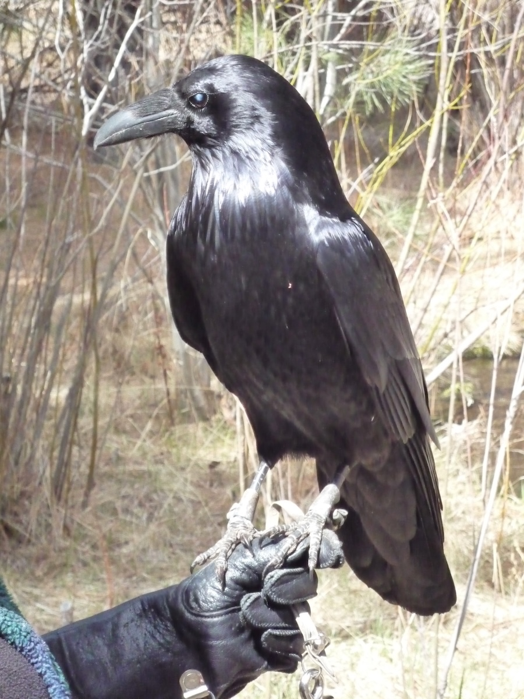

# Photos Server

> [!WARNING]
>
> **THIS IS PROJECT IS IN A STATE OF WILD FLUX**<br>
> Expect breaking changes throughout.

Serves photos from the [Apple
Photos](https://apps.apple.com/app/photos/id1584215428) application
locally on your Mac.

For instance, on my Mac, a request made to
<http://photos.local/C725495D-7037-4E86-94B6-98EDFAE40AF4>
will receive the full-resolution version of this photo:

<p align="center">

</p>

And <http://photos.local/raven?open> will serve a random photo of a raven and then open it in Apple photos.

## Usage

### Client

Make a HTTP request to `http://127.0.63.30/<query>[?open]`...

- `127.0.63.30` can be replaced with a pretty name like `photos.local`,
  if it is defined in the hosts file. (See [Naming the server](#Naming the server) for details.)
- If `<query>` is a valid photo ID in Apple Photos, that photo will be
  returned. If it is not but looks like a UUID you'll get a _404_ error.
- Otherwise, Apple Photos will perform a search for `<query>`, and of the
  results, a random photo will be returned. Results will be limited to
  HEIC, HEIF, JPG, JPEG, TIFF, GIF and PNG files. (No RAW images or videos.)
- If the search produces no valid results, you'll get a _404_.
- If the search takes too long you'll get a _500_ error. (Try narrowing
  your search terms.)
- if `?open` is appended to the URL, the photo also will be opened in
  the Photos app.

### Server

The server is operated by a launch agent,
which forwards HTTP requests to the HTTP handler `photos-http-handler`.

### Command-line utility

The utility `photos-cli` provides several functions
to interact with Apple Photos,
one of which is used by the HTTP handler.

It may be spun-off into its own project/repository at some future time.

## Installation

### Dependencies

The HTTP handler requires the utility `trurl`;
it is available through homebrew as the `trurl` formula.
It is used to parse and decode the incoming URL.

The automated installation requires the `greadlink` command;
it is available as part of the `coreutils` homebrew formula.

### Source files

There are four files to install:

- `photos-cli`,
  which contains functions that automates the Apple Photos Application.
  This is used by the HTTP handler to export photos.
- `photos-http-handler`,
  which generates responses to HTTP requests sent to the server.
- `ca.heckman.photos-server.plist`,
  which initiates the HTTP server on a local port.
- `ca.heckman.photos-server-init.plist`, which redirects requests made
  to `https://photos` to the local server.

#### File locations

The `.plist` files should be put in `~/Library/LaunchAgents`.

The source files expect things to be in the following locations:

- The launch agent `ca.heckman.photos-server.plist` expects
  `photos-http-handler` to be in `/usr/local/libexec`.
- The the HTTP handler `photos-http-handler` expects
  the command-line utility `photos-cli` to be in `/usr/local/bin`
  and `trurl` to be found in `/opt/homebrew/bin`.

These expectations can be edited in the source files.

### Naming the server

If you'd like to refer to the server by name,
rather that as `127.0.63.30`,
then edit the hosts file `/etc/hosts`
to give the server a name.
(Editing this file requires root privileges.)

You'll need to include a line like this one:

```plain-text
127.0.63.30     photos
```

Initially, I liked the name `photos`, but ran into a problem.
Some clients (like the one I was using: Typora)
will not allow for connections to `HTTP` servers
by names other than for a select few,
notably `localhost` and `*.local`,
So now I'm using `photos.local`:

```plain-text
127.0.63.30     photos.local
```

Note that binding `photos.local` name will make it impossible to connect
to a machine on your local network called "photos" with `photos.local`.

(Currently I'm using both `photos.local` and `photos` in my hosts file.)

> [!NOTE]
>
> **Server IP address**
>
> The value of `127.0.63.30` can be changed
> by editing both of the `.plist` files.
> All values starting with `127.` are reserved for _localhost_ addresses.
> I'd avoind `127.0.0.1` as it might be used by a local webserver.

### Automated installation

There is an script called `install.sh` which will copy
the source files to the locations noted above.
Don't run it unless you've grokked the script's source code
and edited it to suit your environment.

The script will not modify `/etc/hosts`; that has to be done manually.

The automated installation does not install
(nor check for the presense of)
the required utilities `trurl` and `greadlink`.

## License

This project is shared under the GNU v3.0 General Public License,
except for the two SVG icons whose copyrights are not held by me:

- The 'broken image' icon was created for Netscape Navigator
  by Marsh Chamberlin (<https://dataglyph.com>).
  The icon's [SVG code](https://gist.github.com/diachedelic/cbb7fdd2271afa52435b7d4185e6a4ad)
  was hand-coded by github user [diachedelic](https://gist.github.com/diachedelic).

- The 'sad mac' icon was created for Apple Inc.
  by Susan Kare (<https://kareprints.com>).
  I hand-crafted the SVG which is embedded in the source code for the response handler.
